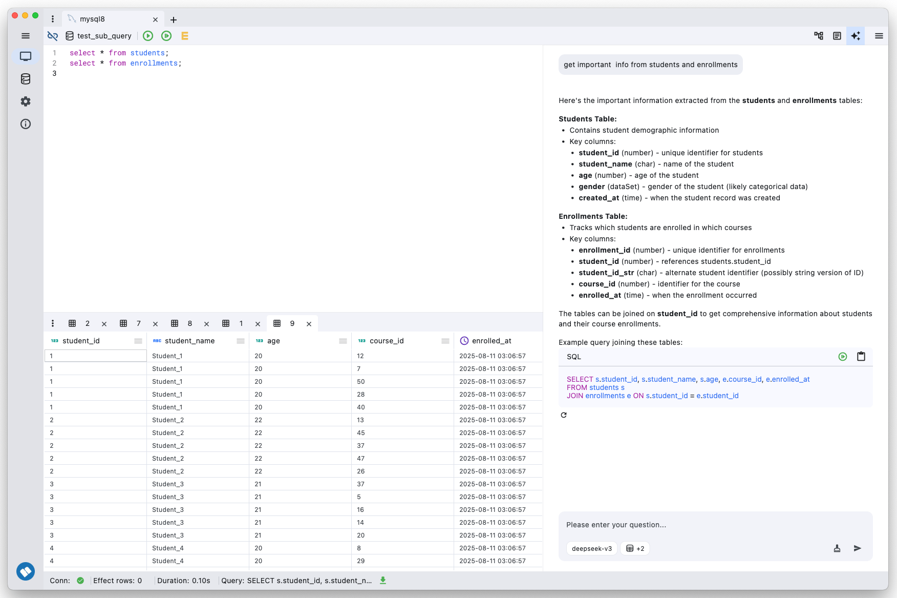

openhare is a professional, cross-platform desktop SQL query tool built with Flutter. Designed for database administrators, developers, and data analysts, openhare delivers a powerful yet intuitive experience for managing and querying databases.

  

## Key Features
- **AI-Powered Assistance**: Now with enhanced AI features to help you write, optimize, and understand SQL queries.
- **Cross-Platform**: Seamlessly runs on Windows, macOS, and Linux.
- **Fully Open Source**: Licensed under the [Apache License 2.0](./LICENSE), openhare is transparent and community-driven.
- **Simple & Intuitive UI**: Modern interface focused on ease of use and productivity.
- **Multi-Database Support**: Effortlessly connect to and manage various SQL databases.

## Roadmap
1. [x] AI editor;
2. [] Support more database;

## Framework
### Application
- [Flutter](https://flutter.dev/)
- [Dart](https://dart.dev/)
- [flutter_rust_bridge](https://github.com/fzyzcjy/flutter_rust_bridge)

### State Management & Routing
- [Riverpod](https://riverpod.dev/)
- [GoRouter](https://pub.dev/packages/go_router)

### UI & UX
- [SQL Editor](https://github.com/reqable/re-editor)
- [PlutoGrid](https://github.com/bosskmk/pluto_grid) (Data grid)
- [HugeIcons](https://github.com/hugeicons/hugeicons-flutter)
- [Bitsdojo Window](https://github.com/bitsdojo/bitsdojo_window)
- [Window Manager](https://github.com/leanflutter/window_manager)

### Storage
- [ObjectBox](https://objectbox.io/)

### DB Driver
- [MySQL](https://github.com/blackbeam/mysql_async) dev on rust with flutter_rust_bridge
- [Postgresql](https://github.com/isoos/postgresql-dart)

## Getting Started
Coming soon.

## License
openhare is licensed under the [Apache License 2.0](./LICENSE).