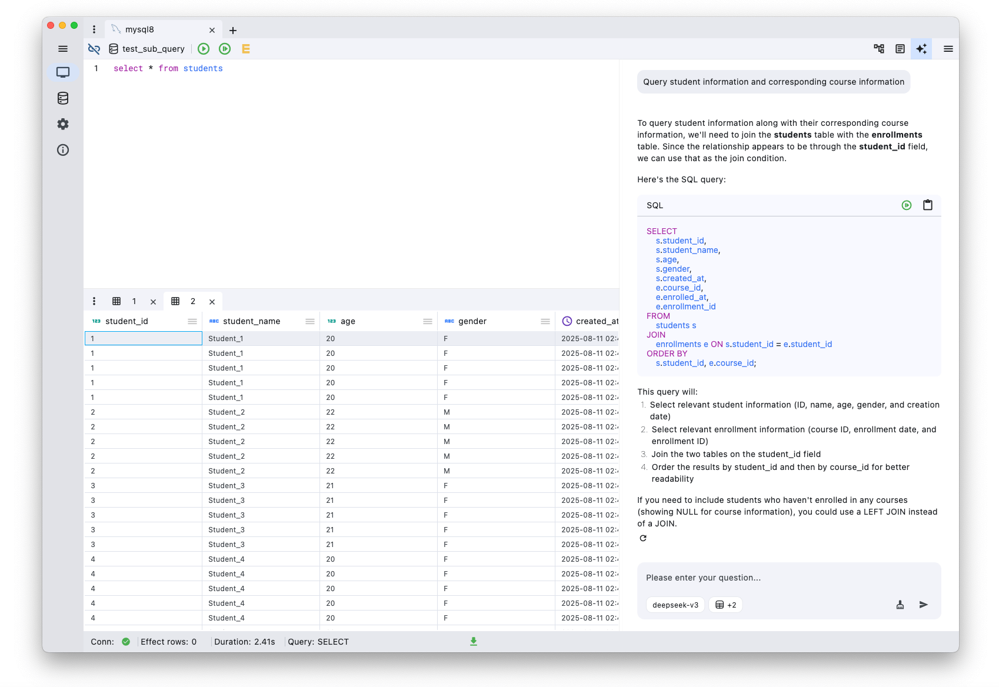

openhare is a professional, cross-platform desktop SQL query tool built with Flutter. Designed for database administrators, developers, and data analysts, openhare delivers a powerful yet intuitive experience for managing and querying databases.

---

  

---

## Key Features

- **Cross-Platform**: Seamlessly runs on Windows, macOS, and Linux.
- **Fully Open Source**: Licensed under the [Apache License 2.0](./LICENSE), openhare is transparent and community-driven.
- **Simple & Intuitive UI**: Modern interface focused on ease of use and productivity.
- **Multi-Database Support**: Effortlessly connect to and manage various SQL databases.

---

## Technology Stack

### Application Framework
- [Flutter](https://flutter.dev/)
- [Dart](https://dart.dev/)

### State Management & Routing
- [Riverpod](https://riverpod.dev/)
- [GoRouter](https://pub.dev/packages/go_router)

### UI & UX
- [PlutoGrid](https://pub.dev/packages/pluto_grid) (Data grid)
- [HugeIcons](https://pub.dev/packages/hugeicons) (Icon library)
- [Google Fonts](https://pub.dev/packages/google_fonts)
- [Multi Split View](https://pub.dev/packages/multi_split_view)
- [Flutter Fancy Tree View](https://pub.dev/packages/flutter_fancy_tree_view)
- [Flutter Breadcrumb](https://pub.dev/packages/flutter_breadcrumb)
- [Bitsdojo Window](https://pub.dev/packages/bitsdojo_window)
- [Window Manager](https://pub.dev/packages/window_manager)

### Database & Data Handling
- [MySQL Client](https://pub.dev/packages/mysql_client)
- [MySQL1](https://pub.dev/packages/mysql1)
- [ObjectBox](https://objectbox.io/)
- [File Picker](https://pub.dev/packages/file_picker)
- [Excel](https://pub.dev/packages/excel)

---

## Getting Started

1. **Download** the latest release for your operating system (coming soon).
2. **Install** and launch openhare.
3. **Connect** to your database and start managing your data with ease.

## License

openhare is licensed under the [Apache License 2.0](./LICENSE).

---

Empowering data professionals with modern, open-source tools.