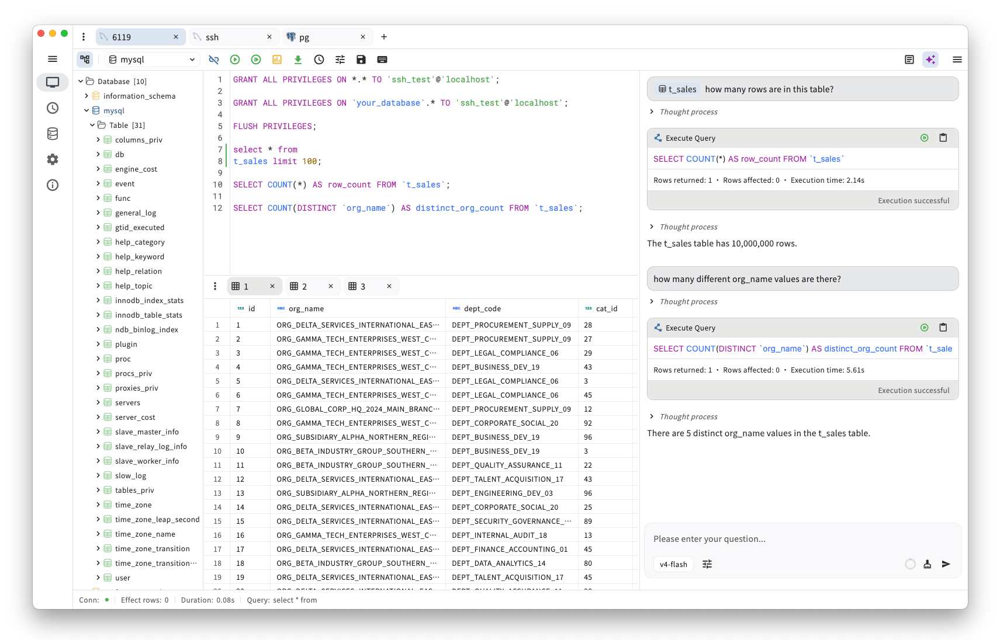

  

openhare 是一款 AI 驱动的跨平台桌面 SQL 客户端，支持多数据库连接，适用于日常开发、数据分析与 DBA 管理等工作场景。

  
  
  
  
  
  
  

  

  <a href="./README.md">English</a> | <strong>简体中文</strong>

## 支持
1. [如何安装和更新应用程序](https://github.com/sjjian/openhare/discussions/75)

## 核心特性
- **轻量原生**：下载即用、安装便捷，无 WebView、无内嵌浏览器；基于 Flutter 原生桌面 UI，内存占用低。
- **AI 智能辅助**：内置 AI 帮助你编写、优化并理解 SQL；高危语句执行前会征求确认，保障数据安全。
- **多数据库支持**：支持 MySQL、PostgreSQL、SQL Server、SQLite、DuckDB、Oracle、MongoDB、Redis 等。
- **跨平台支持**：在 Windows、macOS 和 Linux 上提供原生体验。
- **完全开源**：基于 [Apache License 2.0](./LICENSE) 开源，透明且社区驱动。

## 数据库

数据库驱动均在 [`pkg/db_driver/go_impl`](./pkg/db_driver/go_impl) 中实现，并由 Flutter 客户端通过 Dart FFI 调用。

| 图标 | 数据库 | Go 驱动 |
| --- | --- | --- |
|  | MySQL | [go-sql-driver/mysql](https://github.com/go-sql-driver/mysql) |
|  | PostgreSQL | [jackc/pgx](https://github.com/jackc/pgx) |
|  | SQL Server | [microsoft/go-mssqldb](https://github.com/microsoft/go-mssqldb) |
|  | SQLite | [mattn/go-sqlite3](https://github.com/mattn/go-sqlite3) |
|  | DuckDB | [duckdb/duckdb-go](https://github.com/duckdb/duckdb-go) |
|  | Oracle | [sijms/go-ora](https://github.com/sijms/go-ora) |
|  | MongoDB | [bytebase/gomongo](https://github.com/bytebase/gomongo), [mongodb/mongo-go-driver](https://github.com/mongodb/mongo-go-driver) |
|  | Redis | [redis/go-redis](https://github.com/redis/go-redis) |

**注：** MongoDB 语法以与 mongosh 兼容为目标；具体支持程度请参考 [gomongo](https://github.com/bytebase/gomongo)。

## 技术框架
1. 应用层： [Flutter](https://flutter.dev/)
2. 状态管理： [Riverpod](https://riverpod.dev/), [GoRouter](https://pub.dev/packages/go_router)
3. UI： [SQL Editor](https://github.com/reqable/re-editor), [HugeIcons](https://github.com/hugeicons/hugeicons-flutter), [Window Manager](https://github.com/leanflutter/window_manager)
4. 存储： [ObjectBox](https://objectbox.io/)

## Star 历史

